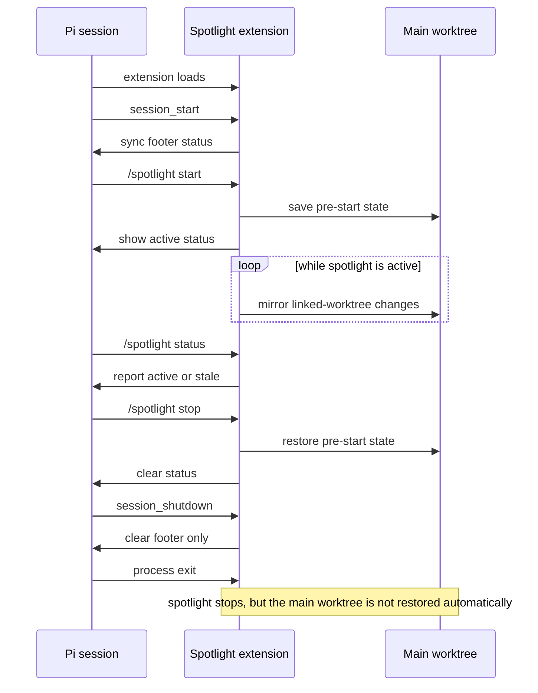

# spotlight

Mirror a linked Git worktree into the repo's main worktree while you work from the linked tree in Pi.

## Requirements

- Run Pi inside a linked worktree created with `git worktree add`
- `watchexec` installed and available on `PATH`
  - macOS/Homebrew: `brew install watchexec`
- A normal Git repo with an existing main worktree

## Usage

In Pi:

```text
/spotlight start
/spotlight status
/spotlight stop
```

- `start` — only valid from a linked worktree, not the main worktree. Saves a rollback checkpoint of the main worktree, then starts a detached watcher.
- `status` — shows whether spotlight is active or stale for the current repo.
- `stop` — stops the watcher and restores the main worktree to the state captured at `start`.

## How it works

1. Resolve the current linked worktree and its shared main worktree.
2. Save the main worktree's pre-start state in a private Git ref under `refs/conductor-checkpoints/`.
3. Launch `spotlighter.sh` in the linked worktree.
4. On each filesystem change, the watcher checkpoints the linked worktree and restores that snapshot into the main worktree.
5. On `/spotlight stop`, kill the watcher and restore the original main-worktree checkpoint.

## Lifecycle and Pi hooks



### Hook summary

- `session_start` — calls `syncStatus()` so the footer reflects any persisted spotlight state for the current repo.
- `session_shutdown` — clears only the UI footer. It does not stop or restore spotlight by itself.
- process `exit` — performs synchronous cleanup for spotlights owned by that Pi process: kill watcher, delete rollback checkpoint, delete state file, do **not** restore the main worktree.
- `/spotlight start` — validates linked-worktree usage, checkpoints the main worktree, starts the detached watcher, persists state, and updates the footer.
- `/spotlight status` — reads persisted state and reports `active` vs `stale` depending on whether the watcher PID is still alive.
- `/spotlight stop` — kills the watcher, restores the pre-start main-worktree checkpoint, deletes persisted state, and clears the footer.

## Notes

- Only one spotlight can be active per repo/main worktree.
- If checkpointing is unsafe because a Git operation is in progress, `start` fails and live sync runs are skipped until the repo is safe again.
- If the watcher exits unexpectedly, `/spotlight status` reports a stale state. Run `/spotlight stop` to clean up and restore the main worktree.
- On normal Pi process exit, spotlight kills its watcher and clears its saved state, but it does **not** restore the main worktree. The mirrored root state stays in place.
- Watcher logs are written to `/tmp/spotlight-<pid>.log`.
- State files live under `~/.pi/agent/spotlight/`.
- Checkpoints use private refs, not `git stash`.
